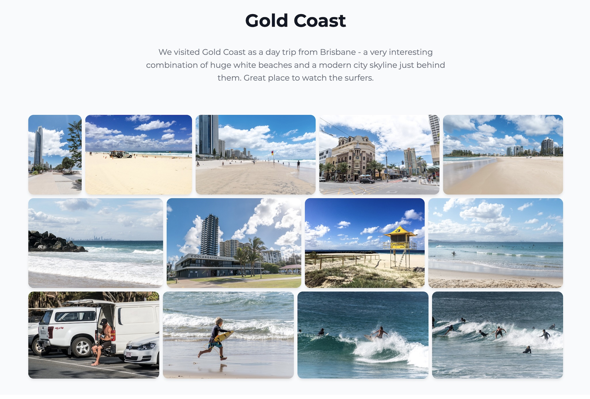

# Simple Photo Gallery

Create beautiful photo galleries from collections in just 30 seconds. No configuration required to get started—simply run two commands in your photos folder and create a static gallery website you can self-host.

This is a free, open-source tool that you can use to generate galleries and self-host them. If you don't want to use the command line or bother with self-hostting, please check out [simple.photo](https://simple.photo) for a hosted solution.

## Example Gallries

<div align="center">
  <a href="https://simple.photo/demo-australia">
    
  </a>
</div>

### More examples

- [California Road Trip](https://simple.photo/demo-california)
- [Visiting Australia](https://simple.photo/demo-australia)
- [Discovering Japan](https://simple.photo/demo-japan)

## Features

    📸 Automatically scan directories with photos and videos
    📝 Show descriptions for photos and videos
    📂 Divide the gallery into sections to tell a story
    🖼️ Create optimized thumbnails for fast loading
    🎥 Play videos directly in the gallery
    📱 Generate galleries that work on all devices
    ⚡ Optimized to be fast and lightweight
    🔧 Generate a static HTML gallery that you can self-host

## Quick Start

The fastest way to create a gallery is to use `npx` in your photos folder:

```bash
npx simple-photo-gallery init
npx simple-photo-gallery build
```

This will:

1. Prompt you for your gallery title, description, and header image
2. Scan your photos and create a `gallery.json` file
3. Generate optimized thumbnails
4. Build a static HTML gallery that you can open in your browser and self-host

## Installation Requirements

- **Node.js 20+** - [Download here](https://nodejs.org/)
- **FFmpeg** (for video support) - Install via:
  - macOS: `brew install ffmpeg`
  - Ubuntu/Debian: `sudo apt install ffmpeg`
  - Windows: [Download from ffmpeg.org](https://ffmpeg.org/download.html)

## Supported Formats

**Images:** JPEG, PNG, WebP, GIF, TIFF  
**Videos:** MP4, MOV, AVI, WebM, MKV

## Detailed Documentation

For advanced usage, customization, and deployment options, see the comprehensive [documentation](./docs/README.md):

- **[Commands Reference](./docs/commands/README.md)** - Detailed guide for all CLI commands
  - [`init`](./docs/commands/init.md) - Initialize new galleries
  - [`build`](./docs/commands/build.md) - Generate static HTML galleries
  - [`thumbnails`](./docs/commands/thumbnails.md) - Generate optimized thumbnails
  - [`clean`](./docs/commands/clean.md) - Remove gallery files
- **[Gallery Configuration](./docs/configuration.md)** - Manual editing of `gallery.json` and advanced features like sections
- **[Deployment Guide](./docs/deployment.md)** - Guidelines for hosting your gallery

## Python Version

The old Python version of Simple Photo Gallery V1 is still available [here](https://github.com/haltakov/simple-photo-gallery), but is now deprecated.

## License

Simple Photo Gallery is licensed under the MIT License - see [LICENSE](./LICENSE) file for details.
